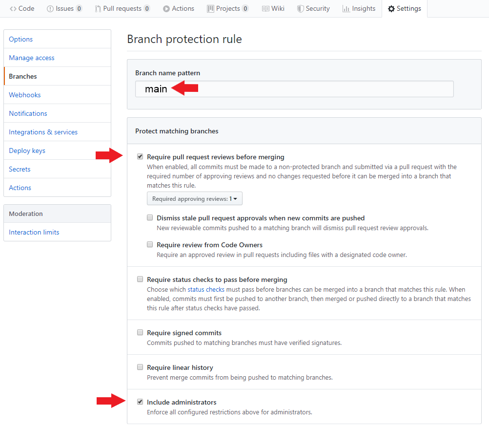

# Students Do: Protect Main Branch

In this activity we will protect our repo's main branch.

## Instructions

* Only one member per project group needs to complete this activity.

* Navigate back to the repo's "Settings" page and then select "Branches" from the left sidebar.

* Click on the "Add rule" button located next to "Branch protection rules".

* Under "Branch name pattern" enter "main" in the input box.

* You should be presented with some options, check off the following:

  * "Require pull request reviews before merging"

  * "Include administrators"

  

* If completed successfully, no one should be able to push directly to the main branch. Instead, all changes must be made in the form of pull requests that are to be reviewed by another group member.

### Hints

* Ask an instructor or TA for assistance if you get stuck!
